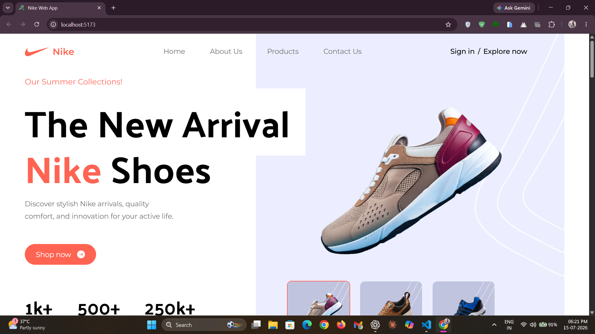
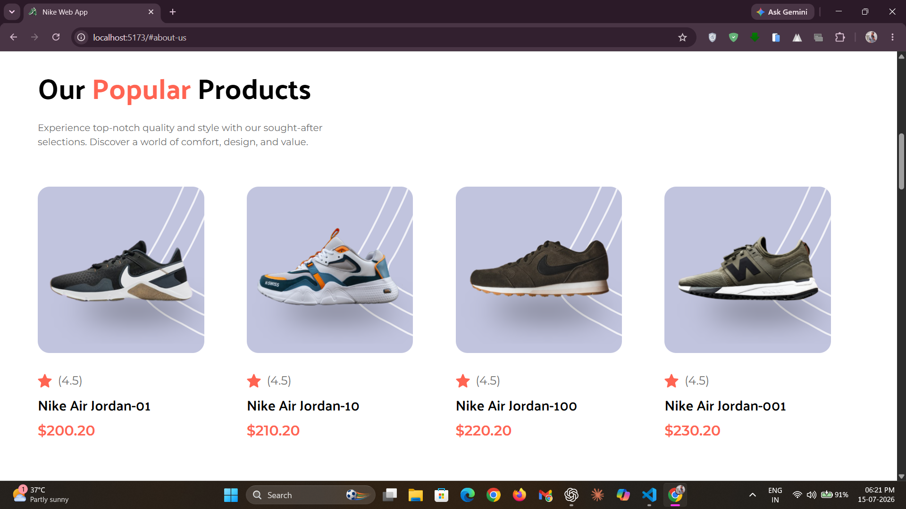
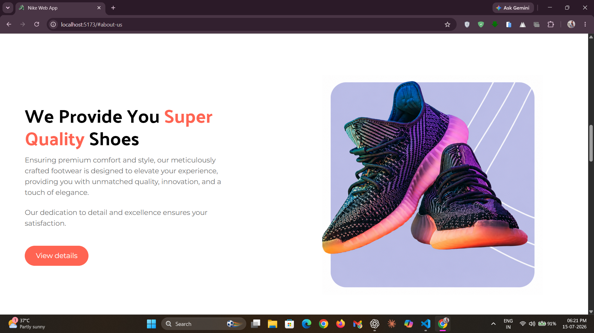
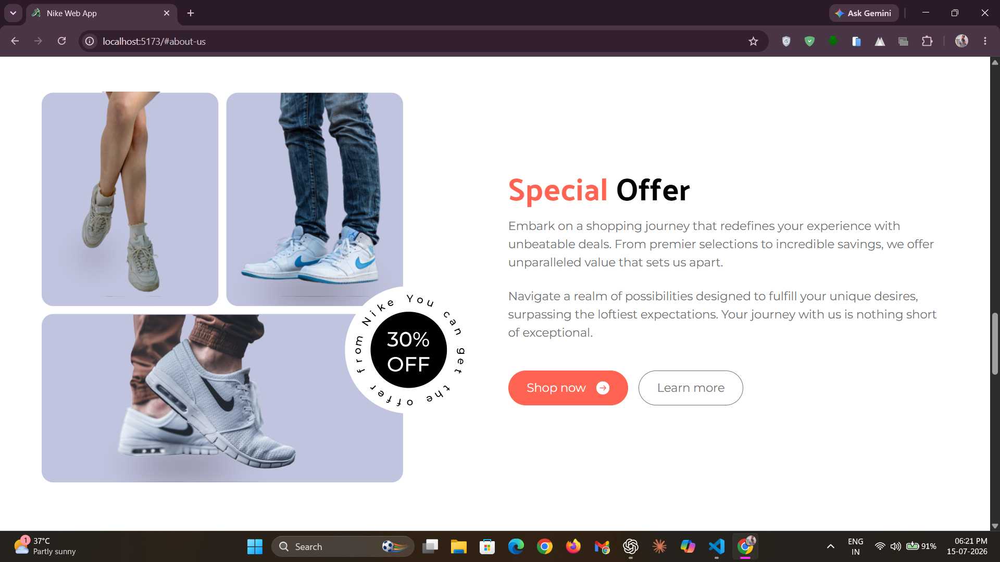
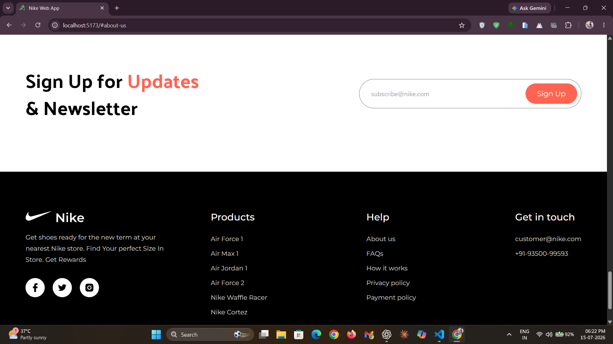
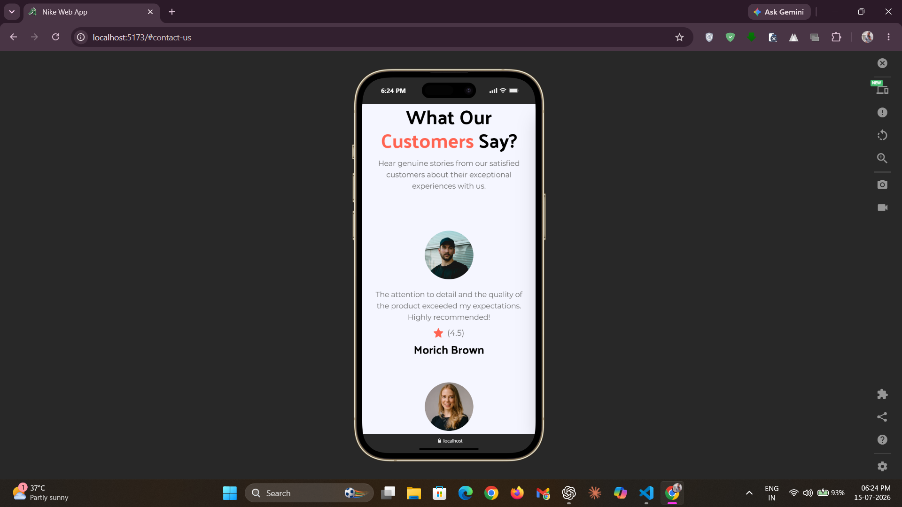

# 👟 Nike Web App

[](https://react.dev/)
[](https://vitejs.dev/)
[](https://tailwindcss.com/)
[](https://developer.mozilla.org/docs/Web/JavaScript)
[](https://developer.mozilla.org/docs/Web/HTML)
[](https://postcss.org/)
[](https://eslint.org/)
[](https://react.dev/learn/thinking-in-react)
[](https://git-scm.com/)
[](https://vercel.com/)

Welcome to `Nike Gallery 👟` - a modern and responsive nike-inspired web application built with **React** and **Vite**. This project focuses on creating a fast, visually appealing, and mobile-friendly user experience while showcasing modern frontend development practices, reusable components, and clean UI design.

**🌐 Experience the Ultimate Sneaker Showcase :** [Live Demo](https://nikegallery.vercel.app/)

## 🔋 Features / Highlights

### 🧭 Responsive Navigation
- Fully responsive navigation bar with a modern `glassmorphic mobile drawer`.
- Smooth slide-in animations, backdrop overlay, and animated hover underline effects.
- Optimized for seamless navigation across desktop, tablet, and mobile devices.

### 🔥 Interactive Hero Section
- Real-time featured shoe preview with smooth `Framer Motion transitions` and preloaded images.
- Dynamic React state updates without page reloads for a seamless experience.
- Clean layered layout with responsive statistics and engaging visuals.

### 🛍️ Scalable Product Showcase
- Responsive product grid that adapts beautifully to every screen size.
- Reusable product cards powered by `centralized data mapping`.
- Easily expandable without modifying UI components.

### 🏆 Engaging Brand Sections
- Dedicated sections for product quality, services, and special offers.
- Flexible layouts automatically adapt from desktop to mobile.
- Reusable button styles with multiple visual variants.

### 💬 Customer Reviews & Newsletter
- Responsive testimonial cards showcasing customer feedback and ratings.
- Modern newsletter subscription form with a mobile-friendly layout.
- Designed to encourage engagement while maintaining a clean interface.

### 🏗️ Modern React Architecture
- `Single Page Application (SPA)` built with reusable React components.
- Centralized data management keeps content organized and scalable.
- Clean Tailwind CSS design system ensures visual consistency throughout the application.

## 📸 Screenshots / Demo

> Take a look at some screenshots showcasing the website.

### 🏠 Landing Page


*The modern hero section featuring the latest `Nike collection` with smooth interactive shoe preview transitions.*

### 🛒 Product Showcase


*Browse popular Nike products presented in a fully responsive and reusable `product grid layout`.*

### 🏆 About Section


*Highlighting Nike's commitment to premium quality, comfort, and innovative craftsmanship.*

### 🏷️ Special Offers


*Dedicated `promotional section` showcasing exclusive deals with responsive call-to-action buttons.*

### 📬 Contact & Newsletter


*`Newsletter subscription section` encouraging users to stay updated with the latest releases and offers.*

### 📱 Responsive Design


*Optimized `mobile-first` experience delivering a seamless interface across all screen sizes.*

## ⚙️ Tech Stack Used

- ⚛️ Frontend Library: React (v18.3.1)
- 🎬 Animation Library: Framer Motion (v12.42.2)
- ⚡ Build Tool: Vite (v5.4.10)
- 🎨 Styling Framework: Tailwind CSS (v3.4.14)
- 🟨 Programming Language: JavaScript (ES6+)
- 🌐 Markup Language: HTML5
- 🎯 CSS Processing: PostCSS & Autoprefixer
- 📱 Responsive Design: Mobile-First Design
- 🧹 Code Quality: ESLint
- 🌿 Version Control: Git & GitHub
- 🔗 Deployment: Vercel

## 🛠️ Setup & Installation

> To set up and run the application locally, follow the steps below:

### 1️⃣ Clone the repository

```bash
git clone https://github.com/deepanshu1420/NikeWebApp.git
```

### 2️⃣ Navigate to the project directory

```bash
cd NikeWebApp
```

### 3️⃣ Install the required dependencies

> Make sure you have `Node.js` installed, then run:

```bash
npm install
```

### 4️⃣ Start the development server

```bash
npm run dev
```

✅ **That's it!** The project should now be running locally at:

```text
http://localhost:5173
```

Open the URL in your browser and explore the premium `Nike-inspired` landing page. ☄️